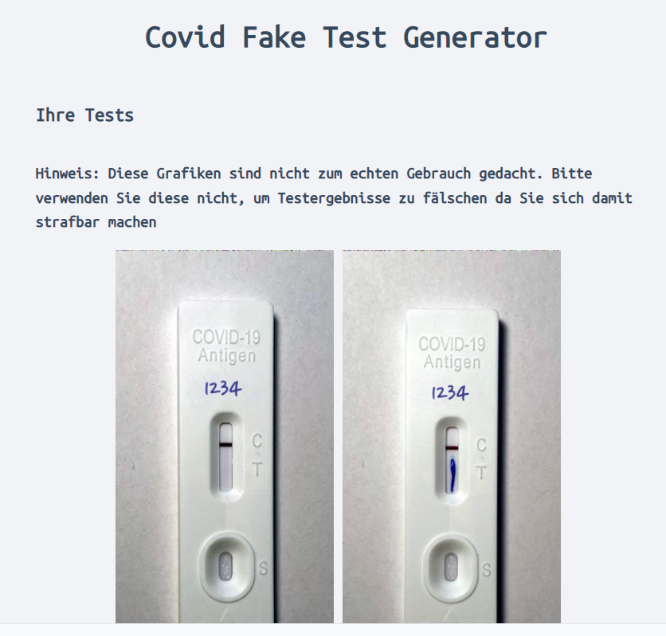

# Covidtestfaker

A small webapp to generate fake covid antigen test images to show how useless the method of simply uploading a proof photo is. This method was valid for some time Vienna, Austria.

Also the first row of pixels is randomized to defeat hash checks

The website is currently only available in german.

Here is an example of the output:

